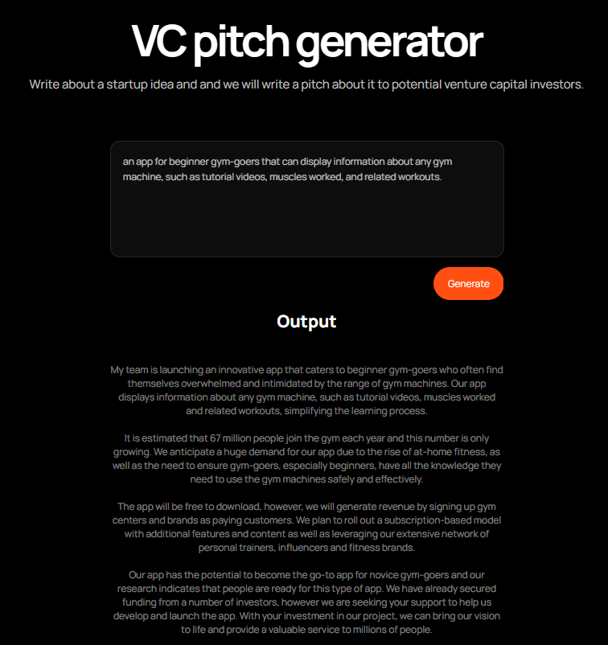

# gpt3-generator
A basic web application that allows you to generate a comprehensive 
pitch for venture capital investors based on a startup idea you input. 
Behind the scenes, we're using GPT-3 through OpenAI and prompt 
chaining to achieve better results.

## Tech Stacks
React, NextJS, Javascript, CSS

## Usage instructions
1. Clone this repository or download the ZIP
2. Navigate to this `/gpt3-generator` directory
3. Install `next`, `react`, and `react-dom`: `yarn add next react react-dom`
3. Run the following command to start the server: `yarn dev`
4. Open your web browser and navigate to http://localhost:3000/

## Example

